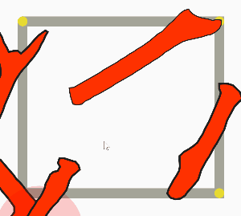

User Interface Coursework
============================
Welcome to the asignment page of user interface course at the University of Tokyo. The entire course schedule is shared in the following link:
https://www-ui.is.s.u-tokyo.ac.jp/~takeo/course/2020/ui/index.html

# The Game
Check the game with key inputs
https://hironoriyh.github.io/



The game interface is composed of boundary, target points, and branches.
Branches can be connected within a certain angle range and importantly one branch must be mirrored. The mirror rule came from the fabrication constraint of 3-axis CNC router. 

## Game Instruction
### Goal: Connect 4 corners by moving branches 
### How to use:  
- Select a branch by Enter key
- Move the branch by Up, Down, Left, Right keys 
- Rotate the branch by Left or Right keys with Control key 
### Colors: 
- Green dots: valid joints. Red dots: invalid joints
- Invalid group: Red branches. Valid group: other colors.

# Assignment 1. Implement your own UI
As the lecture introduced assignment, we'd like you to implement basic UIs such as moving and rotating to manipulate 2D tree branches. The programming language we use here is  Javascript using p5js (Javascript version of Processing); however, it is up to you which language you use. 

The current UI is set with keyboard inputs using the function in the following link.
https://p5js.org/reference/#/p5/keyPressed 

Focusing on basic manipulations (move, rotate, and mirror), you can develop your own interaction. You can set your own goal of UI development, such as intuitive, smooth, or fun. As an intuitive UI example, [you can take mouse inputs.](https://github.com/hironoriyh/ui_lecture_assignment/blob/9f2d841e5770d647dd21f749755b51c29332cd30/js/Events.js#L38) By clicking, a user can select a branch and move/rotate by dragging. Mouse input is just an example. Please feel free to implement your own UI ideas that are highly appreciated!

 

# Assignment 2. User study: Test your UI with participants
While you implement your code, you will become an expert of your UI. To validate usability, you can test the UI with your friends and families. You can first let them use your UI without any instructions to see how intuitive your UI is, and then provide more information such as how to use your UI and the aim of the UI. Please measure the duration for completing the game to see how smooth your UI is. Please summarize findings during user study including interviews. The questions of the interview could be - how intuitive was it and where did you get stuck? - Any comment for improving the UI?


# Folder structure and relevant files to this assignment
The overview of the folder strucutre is as following. 
```
index.html
├── data
│    ├── br12
│         ├──plate.json
│         ...
├── js
│    ├── main.js <-- main loop of p5.js
│    ├── Events.js <-- you can modify this file to for your own interaction
│    ...
│
├── lib   
└── style
```
Within these files, you can focus on ```js/main.js and js/Events.js``` to implement your interaction. On top of that, please take a look on ```data/plate.json``` and how it is read in ```js/LibraryBranch.js```. 

